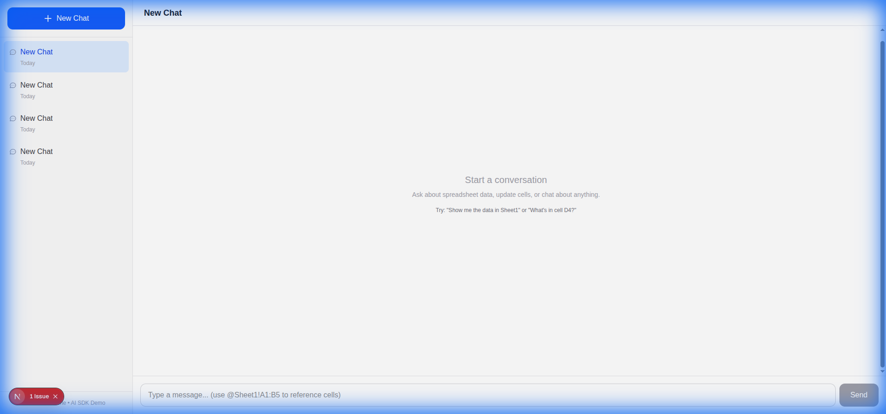

# ChatGPT Clone с XLSX интеграцией

Упрощённый аналог интерфейса ChatGPT с тредами, хранением сообщений в базе данных и генеративным UI на основе Vercel AI SDK.



## 🚀 Демо

**Live:** [testproject-gilt-beta.vercel.app](https://testproject-gilt-beta.vercel.app)

---

## ✅ Реализованный функционал

### 1. Чат с тредами
- ✅ Список тредов в боковой панели
- ✅ Создание нового треда
- ✅ Переключение между тредами
- ✅ Удаление тредов
- ✅ Загрузка истории сообщений из БД

### 2. Персистентность (SQLite)
- ✅ Таблица `threads` (id, title, created_at, updated_at)
- ✅ Таблица `messages` (id, thread_id, role, content, tool_calls, created_at)
- ✅ Автоматическая миграция при запуске

### 3. Generative UI / Tools
- ✅ `getRange` — чтение диапазона ячеек из XLSX
- ✅ `readCell` — чтение одной ячейки
- ✅ `updateCell` — запись в ячейку с подтверждением
- ✅ `deleteThread` — удаление треда с подтверждением

### 4. Подтверждение опасных действий
- ✅ UI-карточка с кнопками "Yes, proceed" / "No, cancel"
- ✅ Действие выполняется только после подтверждения
- ✅ Успешное обновление отображается с ✅

### 5. Работа с XLSX
- ✅ Файл `/public/example.xlsx` с sample данными
- ✅ Визуальное представление таблицы в чате
- ✅ Модальное окно с полной таблицей
- ✅ Выделение ячеек мышкой
- ✅ **Вставка меншонов** — кнопка "Insert Reference" вставляет `@Sheet1!A1:B5` в поле ввода

---

## 🛠 Технологический стек

| Компонент | Версия | Назначение |
|-----------|--------|------------|
| Next.js | 16.1.1 | App Router, TypeScript |
| AI SDK | 4.x | useChat, streamText, tools |
| @ai-sdk/openai | 1.x | OpenAI провайдер |
| better-sqlite3 | latest | SQLite для хранения |
| xlsx | latest | Работа с таблицами |
| Tailwind CSS | 4.x | Стилизация |
| zod | 3.x | Валидация параметров tools |

---

## 📁 Структура проекта

```
app/
├── api/
│   ├── chat/route.ts        # Стриминг ответов AI + tools
│   └── threads/route.ts     # CRUD для тредов
├── components/
│   ├── chat/ChatArea.tsx    # useChat + отображение сообщений
│   ├── threads/ThreadList.tsx
│   └── xlsx/TableModal.tsx  # Модалка с выбором ячеек
├── lib/
│   ├── db/index.ts          # SQLite операции
│   └── xlsx/index.ts        # Чтение/запись XLSX
├── types/index.ts
├── page.tsx
└── layout.tsx
public/
└── example.xlsx             # XLSX файл с sample данными
data/
└── chat.db                  # SQLite база (создаётся автоматически)
```

---

## 🚀 Запуск проекта

### Установка зависимостей
```bash
npm install
```

### Настройка OpenAI ключа
```bash
echo "OPENAI_API_KEY=ваш-ключ" > .env.local
```

### Запуск development сервера
```bash
npm run dev
```

Откройте [http://localhost:3000](http://localhost:3000)

---

## 🧪 Протестированный функционал

| Функция | Статус |
|---------|--------|
| AI стриминг | ✅ Работает |
| getRange (чтение таблицы) | ✅ Работает |
| updateCell (запись) | ✅ Работает |
| Подтверждение Yes/No | ✅ Работает |
| Персистентность в SQLite | ✅ Работает |
| Модальное окно таблицы | ✅ Работает |
| Выделение ячеек | ✅ Работает |
| Insert Reference | ✅ Работает |

---

## 📝 Примеры использования

**Чтение данных:**
> "Покажи данные из Sheet1 с A1 по D7"

**Обновление ячейки:**
> "Измени ячейку C3 на 5000"  
> *(появится подтверждение → нажать "Yes, proceed")*

**Вставка ссылки на ячейки:**
1. Кликните на таблицу в чате
2. Выделите нужные ячейки в модальном окне
3. Нажмите "Insert Reference"
4. В поле ввода появится `@Sheet1!A2:C4`

---

## ⚠️ Ограничения

- На Vercel SQLite сбрасывается при каждом деплое
- Один XLSX файл (`/public/example.xlsx`)

---

## 📄 Лицензия

MIT
